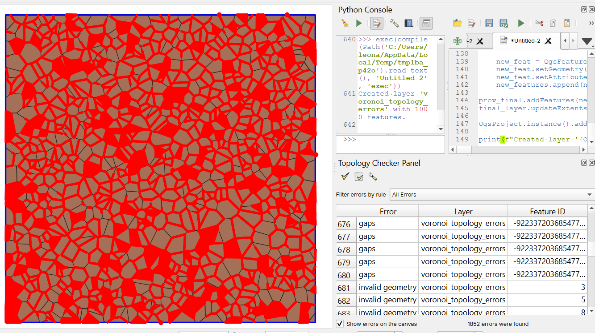
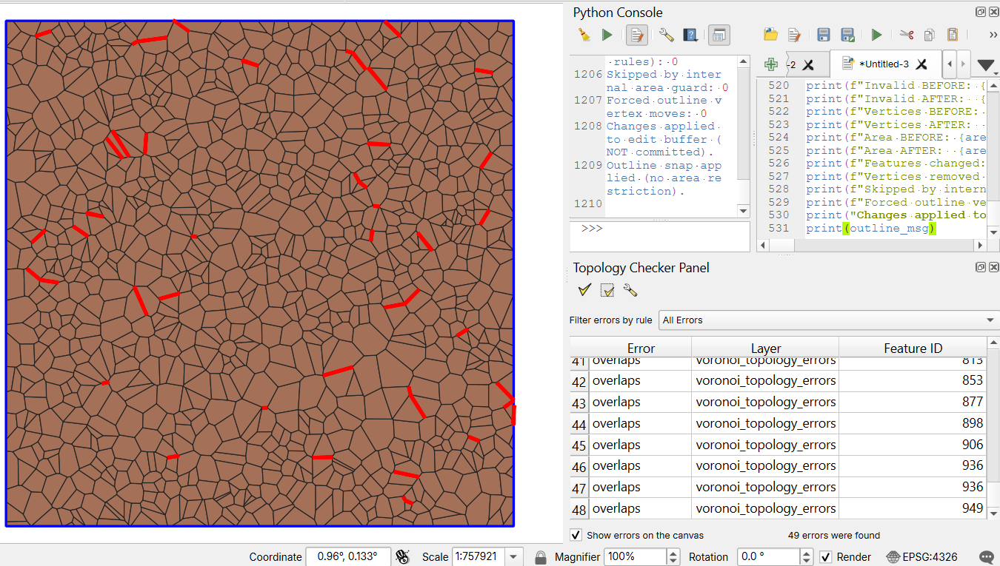
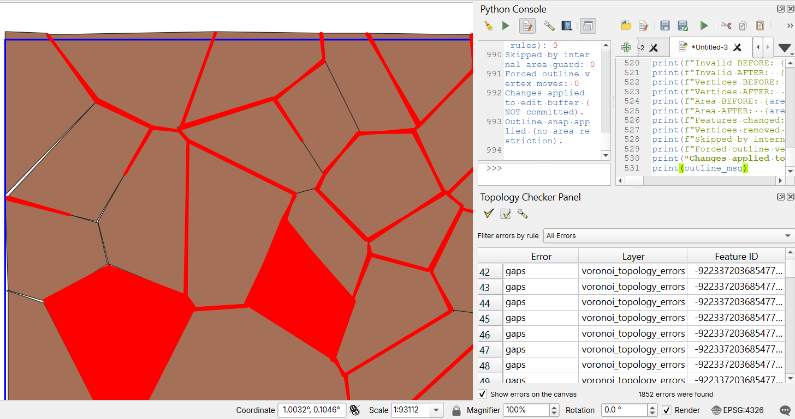
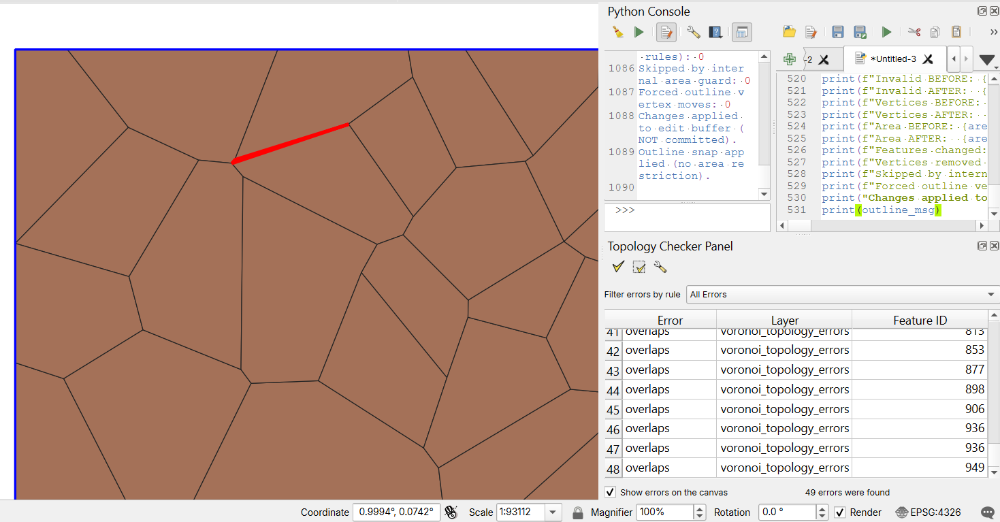

# QGIS Topology Cleaner (PyQGIS)

Fix polygon topology in QGIS using PyQGIS: repair invalid geometries, clean vertices, and align boundaries while preserving area.

---

## Results

### Overview

**Before**

**After**

### Detail

**Before**

**After**

---

## Quantitative results

Tested on synthetic Voronoi datasets with injected topology errors:

### Dataset 1 (~1,000 polygons)

* Initial topology errors: ~1,800
* After cleaning: ~40–50
* Error reduction: **~97%**

### Dataset 2 (~10,000 polygons)

* Initial topology errors: ~17,000
* After cleaning: ~1,300
* Error reduction: **~92%**

> Results may vary depending on data quality and tolerance parameters.

### Notes

* Residual errors are typically complex edge cases or require global topology reconstruction.
* The workflow prioritizes **local stability and area preservation** over aggressive correction.

---

## What this solves

Polygon datasets (especially tessellations, Voronoi outputs, and heavily edited layers) often contain:

* invalid geometries
* small local spikes / duplicated vertices
* imperfect boundary alignment
* outer boundary mismatch against a trusted outline

This workflow addresses these issues while prioritizing **shape stability and repeatability**.

---

## Features

### `qgis_topology_cleaner.py`

* Repairs invalid polygon geometries (`native:fixgeometries`)
* Harmonizes shared boundaries between adjacent polygons (`native:snapgeometries` self-snap)
* Removes local spurious vertices with conservative geometric rules:

  * short-edge condition
  * near-collinearity condition
  * proximity-to-outline condition
* Applies per-feature **internal area-change guard**
* Optionally snaps polygons to an external outline
* Optional **forced outline fit** for near-boundary vertices
* Optional **outer-ring-only forced fit** to preserve interior holes
* Works with selection-only mode or full-layer mode
* Safe fallback when outline layer is missing or empty

### `topology_seed_generator.py`

* Creates random points
* Builds Voronoi polygons
* Injects controlled coordinate perturbations
* Randomly inserts duplicated vertices
* Outputs an in-memory polygon layer: `voronoi_topology_errors`

---

## Quick start

1. Load your polygon layer in QGIS
2. (Optional) Load an outline polygon layer
3. Open **Plugins → Python Console**
4. Run `qgis_topology_cleaner.py`
5. Review output report in console
6. Save edits / commit layer changes if results are satisfactory

To generate synthetic test data first, run `topology_seed_generator.py`.

---

## Key configuration (`qgis_topology_cleaner.py`)

Main parameters are grouped at the top of the script:

* `INPUT_LAYER_NAME`: polygon layer to clean
* `OUTLINE_LAYER_NAME`: optional boundary layer
* `PROCESS_SELECTED_ONLY`: process selection only vs full layer
* `SNAP_TOLERANCE`: base tolerance (CRS units)
* `MAX_INTERNAL_AREA_DELTA_RATIO`: internal deformation guard
* `ENABLE_OUTLINE_SNAP`: enable/disable outline phase
* `FORCE_OUTLINE_FIT`: force near-boundary vertices onto outline segments
* `FORCE_OUTLINE_OUTER_RING_ONLY`: apply forced fit only to exterior rings

> All tolerances are interpreted in the input layer CRS units.

---

## Processing logic (high-level)

1. Geometry fix
2. Internal self-snap
3. Conservative local cleanup
4. Internal area guard
5. Geometry fix
6. Optional outline snap (no area guard)
7. Optional forced outline fit (no area guard)
8. Final geometry fix
9. Apply back to source layer (edit buffer, not auto-committed)

---

## Repository structure

* `qgis_topology_cleaner.py`
* `topology_seed_generator.py`
* `examples/`

  * `before_overview.png`
  * `after_overview.png`
  * `before_detail.png`
  * `after_detail.png`

---

## Requirements

* QGIS 3.x (PyQGIS environment)
* Processing framework enabled (default in QGIS)

> Scripts are intended to run in the **QGIS Python Console**.

---

## Limitations

* This workflow focuses on robust **local corrections**
* It does not perform full global topology reconstruction on severely degraded datasets
* Very noisy datasets may require iterative runs until convergence

---

## Recommended usage notes

* Start with conservative tolerance values
* If your CRS is geographic (degrees), calibrate tolerances carefully
* For production workflows, test on a subset first
* Run iteratively when needed and monitor:

  * invalid geometry count
  * changed features
  * area deltas

---

## License

MIT

---

## Author

Leonardo Martínez
